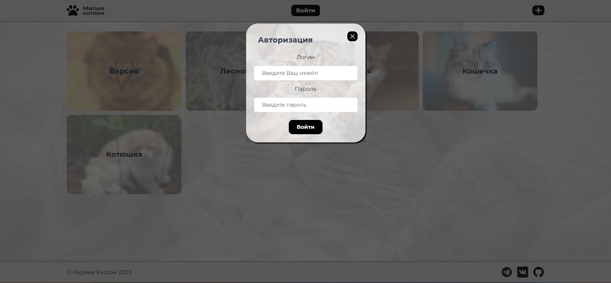

# Милые коты 

### [Сайт с котами и их характеристиками](https://gor241.github.io/catsUpt/)

## Screenshots:
 | 
--- | ---
 | 
--- | ---
 | 
--- | ---
 | 
--- | ---
 | 

## Функциональность:
- сайт со своим уникальным списком фотокарточек(доступно при входе)
- возможность добавлять/удалять карточки с котами
- просматривать общий список
- взаимодействие с Api;
- авторизация (LocalStorage);
- открытие/ закрытие модальных окон с формой добавления/удаления и редактирования
карточек.
-адаптивная вёрстка

## Планы по странице:
- донастроить api 
